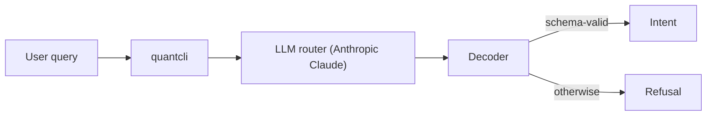
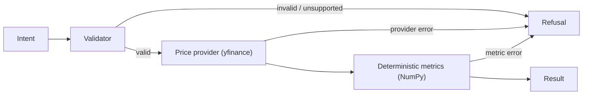

# QuantCLI

A guardrail-first CLI for financial analytics, using an LLM for intent parsing and deterministic code for all computation.

## Features
- Natural language → strict, schema-validated intent
- Deterministic, unit-tested financial metrics (no AI in computation)
- Hard failure modes: every run returns a Result or a structured Refusal
- JSON-only output with exit codes (automation-safe)

## Install & Run
```bash
git clone BLAH BLAH
cd ai-quant-analytics-cli
pip install -e .

export ANTHROPIC_API_KEY=...
quantcli "max drawdown AAPL last 10 days"
```
- One-shot CLI (not a REPL)
- JSON-only stdout

## Example Queries
```bash
quantcli "What was AAPL’s total return over the last 30 days?"
quantcli "Compute the max drawdown for TSLA over the last 60 days."
quantcli "Compute realized volatility for MSFT over the last 90 days with a 20 day window."
```

### Example refusal query
```bash
quantcli "Compute realized volatility for MSFT over the last 90 days."
```

## Architecture



## Guarantees
- No guessing, retries, or JSON repair
- Malformed or ambiguous requests return a structured refusal
- Strict boundary between probabilistic routing and deterministic execution

