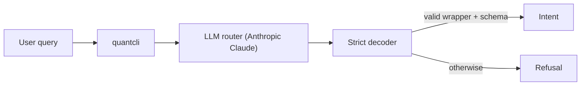
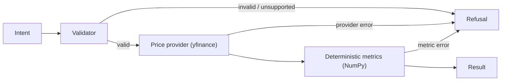

# QuantCLI

A guardrail-first CLI for financial analytics, using an LLM for intent parsing and deterministic code for all computation.

## Features
- Natural language → strict, schema-validated intent
- Deterministic, unit-tested financial metrics (no AI in computation)
- Hard failure modes: every run returns a `Result` or a structured `Refusal`
- JSON-only output with exit codes (automation-safe)

## Install & Run
```bash
git clone git@github.com:ihemmige/ai-quant-analytics-cli.git
cd ai-quant-analytics-cli
pip install -e .

export ANTHROPIC_API_KEY=...
quantcli "max drawdown AAPL last 10 days"
```

## Example Queries
```bash
quantcli "What was AAPL’s total return over the last 30 days?"
quantcli "Compute the max drawdown for TSLA over the last 60 days."
quantcli "Compute realized volatility for MSFT over the last 90 days with a 20 day window."
```

### Example refusal query (returns a structured refusal)
```bash
quantcli "Compute realized volatility for MSFT over the last 90 days."
```

## Architecture
### Stage 1: Probabilistic Routing


### Stage 2: Deterministic Execution

Once decoding completes, no LLM output is consulted again.

## Pluggable Components (Protocol-Based)
- The LLM client and price provider are dependency-injected and replaceable
- Any implementation may be used as long as it satisfies the defined protocol
- All external components are treated as untrusted
- Guardrails are enforced at boundaries, not by provider implementations
- This enables deterministic testing, offline unit tests, and strict control over probabilistic components.

## Guarantees
- No guessing, retries, or JSON repair
- Ambiguous or unsupported requests return an explicit, structured `Refusal` (no silent fallbacks)
- Strict boundary between probabilistic routing and deterministic execution
- JSON-only stdout (third-party stdout/stderr suppressed)
