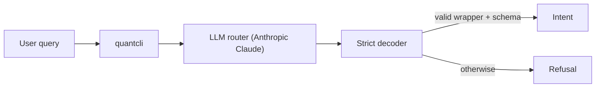
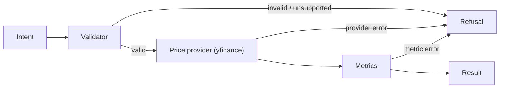

# QuantCLI

A guardrail-first CLI for financial analytics, using an LLM for intent parsing and deterministic code for all computation.

## Features
- Natural language → strict, schema-validated intent
- Deterministic, unit-tested financial metrics (no AI in computation)
- Validation-first execution with explicit failure modes (`Result` or `Refusal`)
- JSON-only output with exit codes (automation-safe)

## Install & Run
```bash
git clone git@github.com:ihemmige/ai-quant-analytics-cli.git
cd ai-quant-analytics-cli
pip install -e .

export ANTHROPIC_API_KEY=...
quantcli "max drawdown AAPL last 10 days"
```

## Example Queries
```bash
quantcli "Compute the max drawdown for TSLA over the last 60 days."
quantcli "Compute realized volatility for MSFT over the last 90 days with a 20 day window."
quantcli "What was AAPL’s total return over the last 30 days?"
```

### Example invalid query (returns a structured refusal)
```bash
quantcli "Compute realized volatility for MSFT over the last 90 days."
```

## Implemented Metrics
The following metrics are currently supported for single-asset analysis:

- `max_drawdown`
- `realized_volatility`
- `total_return`

## Architecture
### Stage 1: Probabilistic Routing


### Stage 2: Deterministic Execution

Once decoding completes, no LLM output is consulted again.

## Guarantees
- No guessing, retries, or JSON repair from LLM
- Ambiguous or unsupported requests return an explicit, structured `Refusal` (no silent fallbacks)
- Strict boundary between probabilistic routing and deterministic execution
- JSON-only stdout (third-party stdout/stderr suppressed)

## Future Enhancements
- Additional metrics (e.g. rolling returns, downside risk)
- Deterministic multi-asset and portfolio analytics
- Internal logging for improved observability
